<h1 align="center" color="blue">
  
   
  Virtual Library
   
</h1>

<i> A Virtual Book Library application that provides options to have 2 types of users, admin, and reader. It has authentication and authorization. Admin has extra possibilities like adding new books, deleting books, or adding new administrators.
Users can search books quickly, view information about books, and ratings, read comments, put likes, and dislikes, put comments, and reply to other comments. Also, users can make their lists of books where they can put books they want and search public lists from other users. </i>
## 🚩 Table of Contents

- [App Features](#app-features)
  - [Sign up](#sign-up)
  - [Logged in](#logged-in)
    - [Search books](#search-books)
    - [Profile options](#profile-options)
    - [Lists of books](#lists-of-books)
- [Why TOAST UI Editor?](#-why-toast-ui-editor)
- [Features](#-features)
- [Examples](#-examples)
- [Browser Support](#-browser-support)
- [Pull Request Steps](#-pull-request-steps)
- [Contributing](#-contributing)
- [TOAST UI Family](#-toast-ui-family)
- [Used By](#-used-by)
- [License](#-license)
##  📝 App Features
### Sign up
As a user, u can create a new account from the signup page or u can log in if u already have an account on the sign-in page. To create a new account you must enter your name, last name, date of birth, username, and password and choose your photo. 

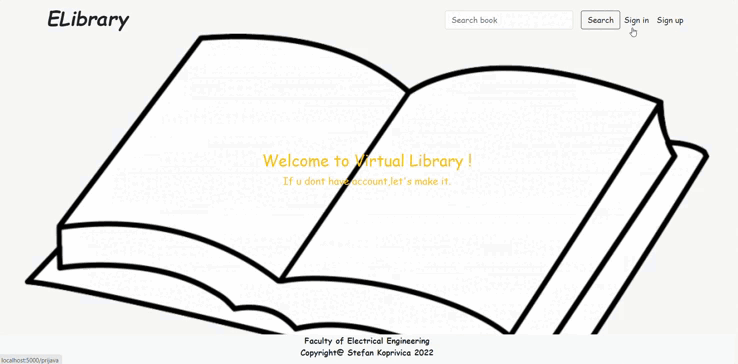

If you don't enter all fields it will alert you to enter empty an field.

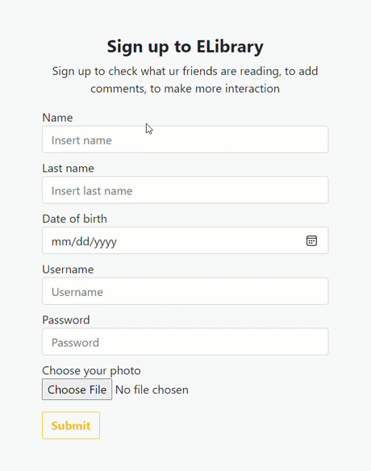

If you are not logged in u can also search books by book name by typing it in the input field. The non-logged user only can read information and comments about books but can't add any new information.

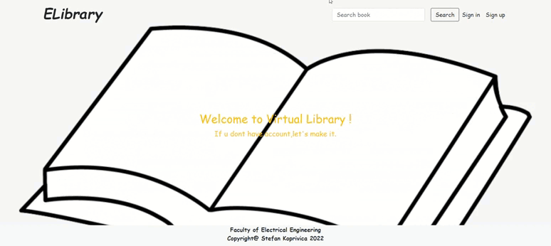

### Logged in
Once the user is logged in, he can search books by author, name, or keyword. On the left side of the page, the user can see lists of books that he has read and lists of books that he wants to read.

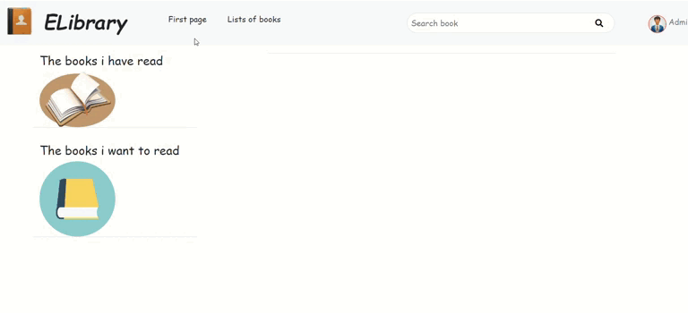

#### Search books
When the user searches for books, all books that match the search will be displayed. User can click on the button "Want to read" if he wants to read that book or "Read it" if he read the book. The option to delete a book is only available to administrators.

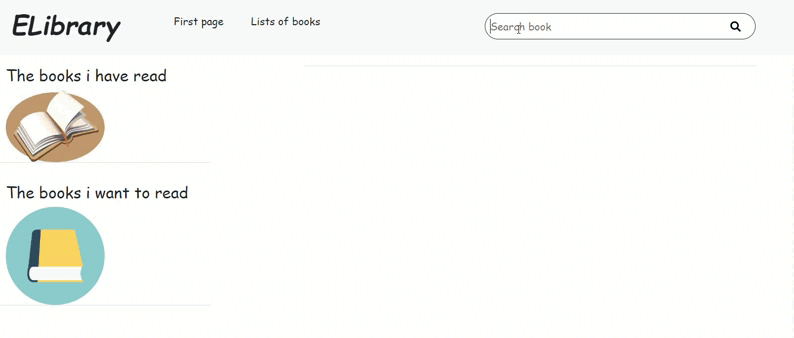

When the user clicks on the book, the page that shows book information will appear.  There the user can see the book photo on the left side, and on the right side, the main information about the book will appear. The book rating is the average rating of all ratings. Above that, the user can rate the book by clicking on stars. Above that, the user can read comments from other users, write his comments, add replies to comments, and put likes/dislikes on comments.

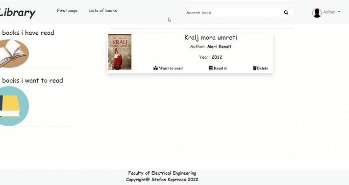

#### Profile options
In the right top corner user can open a drop-down menu where he can see the name of the logged user. There is an option "Profile" where the user can see his information and books that he added if he is an administrator.

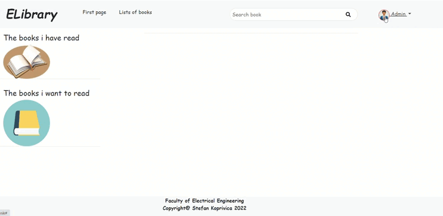

Option "Add administrator" where the administrator can see a list of all users and their privileges and add administrator role to any user that is not admin.

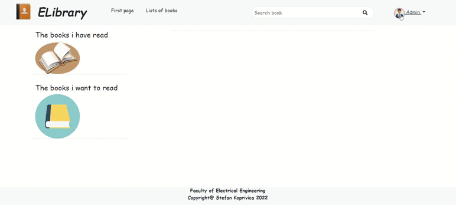

 With the option "Add new book" the user can add new books to the system. With the option "Log out" the user can log out from the system. Options "Add administrator" and "Add new book" are available only for administrators.
 
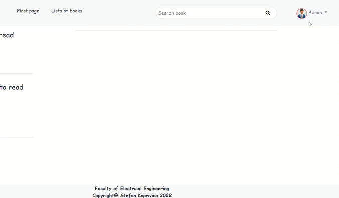

#### Lists of books

There is the option "Lists of books" in the navigation bar. When the user clicks on that option the page about lists of books will appear. In that section, the user can see lists that he created on the left side of the page. Every list has photos of some books that were added to it, the name of the list, and number of books that that list contains.

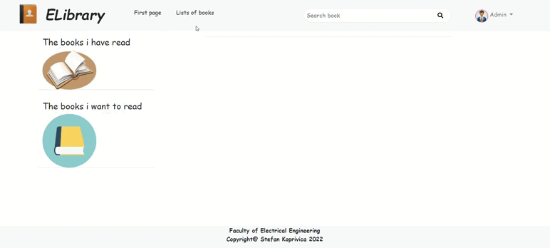

At the right side of the page, there is an input field where users can search lists from other users that are marked as public.

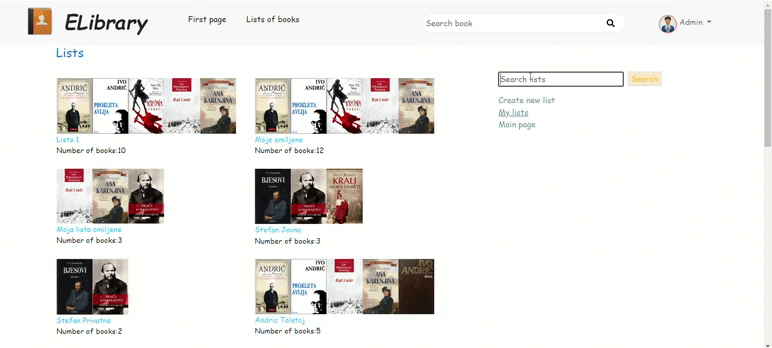

Also, users can create a new list by clicking on the option "Create new lists". When the user clicks on that option the form for creating a new list will show. There user must enter the name of the list and choose is list public or private. Other users can find public lists, but can't private. When a user clicks on "Create", a new list will be created.

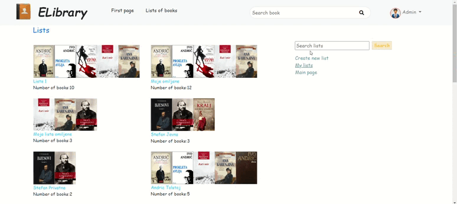

When the new list is created, the alert will show that the list is created. There are options "Added books" where users can see all books that are added to the list, and "Add books to list" where users can search books and add books they want to the list.

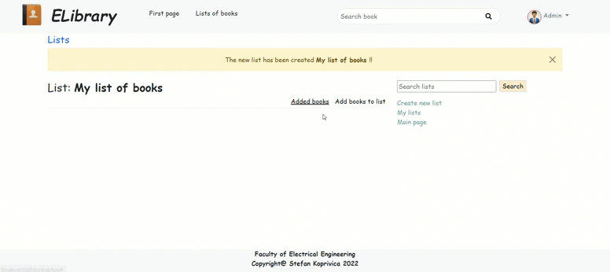

When a user clicks on some list, via search or on their list, he can see all books that are on the list and he can put new books in the list also.

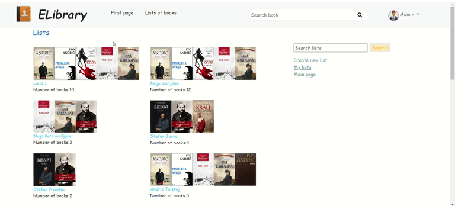
